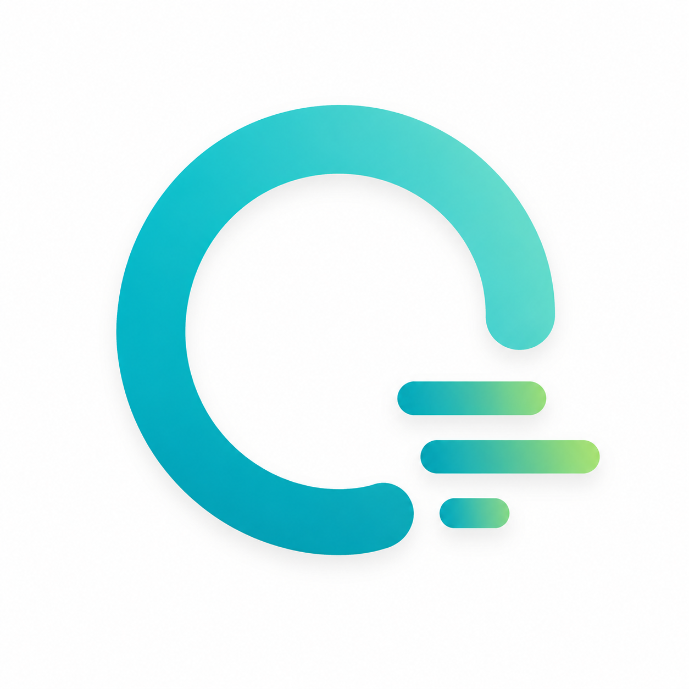

  
  <h1>Outflow</h1>
  
A minimal, aesthetically pleasing Android application for tracking personal cash flows.

   
  
  

Built with Jetpack Compose and Room, Outflow focuses on absolute simplicity and a premium pitch-black monochrome aesthetic. It helps you track where your money comes from and where it goes, completely offline.

## Features

- **Frictionless Logging**: Record financial transactions with a title, exact amount, and category.
- **Directional Flow**: Tag every entry instantly as an Inflow (money gained) or Outflow (money spent).
- **Live Summary Card**: A real-time header automatically calculates and displays your total In, total Out, and Net balance.
- **Chronological Feed**: View your entire financial history in a beautifully spaced, reverse-chronological list.
- **Gesture Management**: Swipe horizontally on any transaction to instantly delete it from your records.
- **Premium UI Design**: Built with a true pitch-black background, edge-to-edge layouts, fluid micro-animations, and dynamic segmented buttons.
- **Privacy First**: All data is stored locally on your device using an embedded SQLite database. No tracking, no cloud sync, just your data.

## Tech Stack

- **UI Framework**: Jetpack Compose (Material 3)
- **Database**: AndroidX Room (SQLite)
- **Architecture**: MVVM (Model-View-ViewModel) with Kotlin Coroutines and StateFlow
- **Typography**: Fully custom variable font implementation (Google Sans Flex) with stylistic alternates and ligatures.
- **Build System**: Gradle (Kotlin DSL ready)

## Getting Started

### Prerequisites
- Android Studio (latest stable release recommended).
- A physical device or emulator running Android 7.0 (API level 24) or higher.

### Building from Source
1. Clone this repository to your local machine.
2. Open the project in Android Studio.
3. Let Gradle sync the project dependencies.
4. Connect your device or start an emulator.
5. Click "Run" or execute `./gradlew assembleDebug` to build and install the APK.

## License

This project is open-source and freely available for personal use, learning, and modification.
