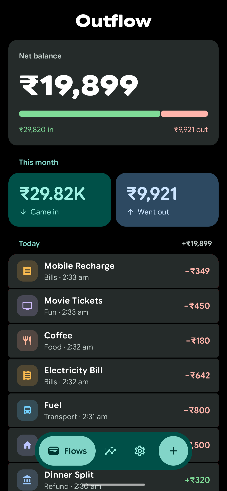
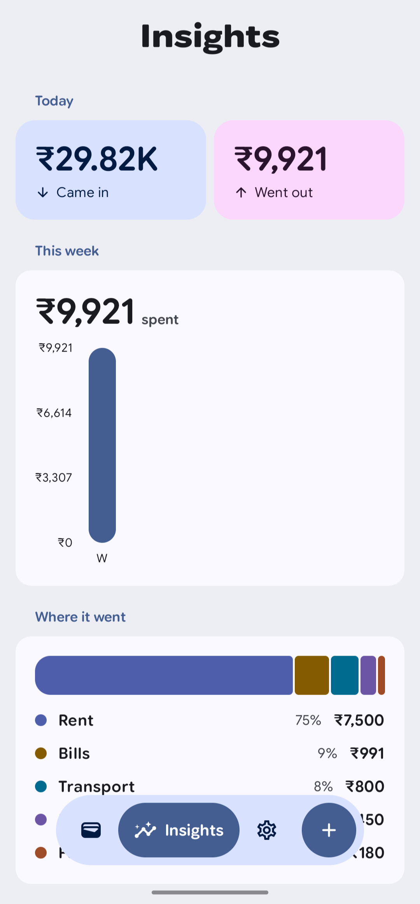
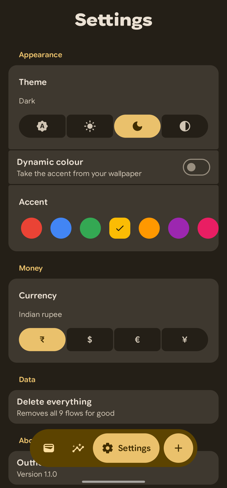
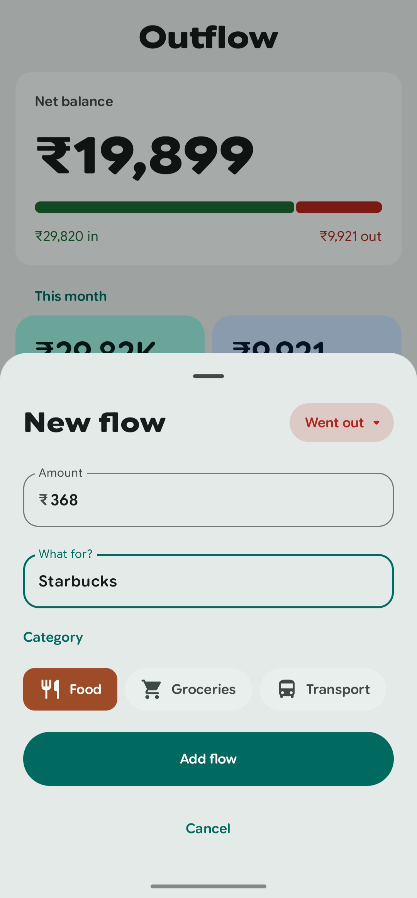
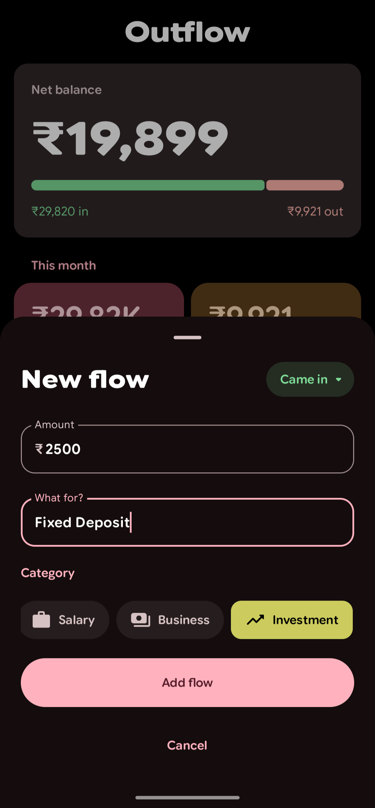
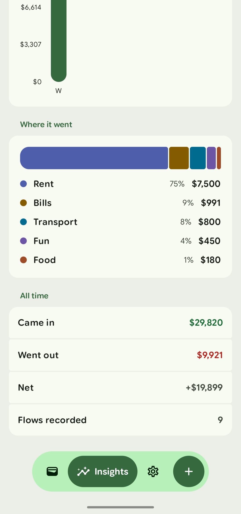

<div align="center">
  
  <h1>Outflow</h1>
  <p>A minimalist personal finance tracker built on Material 3 Expressive design guidelines.</p>
  <br />
  
  <a href="https://github.com/iambhvsh/outflow/network/members"></a>
  <a href="https://github.com/iambhvsh/outflow/stargazers"></a>
  <a href="https://github.com/iambhvsh/outflow/issues"></a>
  <br /><br />
  <a href="https://github.com/iambhvsh/outflow/releases/latest/download/outflow-release.apk">
    
  </a>
  <a href="https://github.com/iambhvsh/outflow/releases/latest/download/outflow-debug.apk">
    
  </a>
  <br /><br />
  
  
</div>

<br />

Outflow is an open-source Android application for tracking personal cash flows. It operates completely offline and focuses on providing a high-quality user experience using modern Android UI patterns.

## 📑 Table of Contents
- [Screenshots](#-screenshots)
- [Privacy is Core](#-privacy-is-core)
- [Design](#-design)
- [Features](#-features)
- [Tech Stack](#-tech-stack)
- [Getting Started](#-getting-started)
- [Roadmap](#-roadmap)
- [Issues & Contributions](#-issues--contributions)
- [Contact](#-contact)
- [Acknowledgments](#-acknowledgments)
- [License](#-license)

## 📱 Screenshots
<div align="center">
  
  
  
  <br/>
  
  
  
</div>

## 🛡️ Privacy is Core

Outflow respects your privacy seriously. The app operates **100% offline** and all data is stored locally on your device via an embedded SQLite database. 
- **No Analytics**: We do not track your usage, clicks, or behavior.
- **No Cloud Sync**: Your financial data never leaves your device.
- **No Third-Party SDKs**: Built exclusively with standard Android libraries.

## 🎨 Design

Outflow is built strictly upon the **Material 3 Expressive** design system. 
- **Theming**: Includes Light, Dark, and True Black (OLED) themes, alongside an automatic system mode.
- **Dynamic Color**: Extracts and applies color palettes directly from your device wallpaper (Android 12+).
- **Accent Colors**: 8 distinct accent colors are available for devices that do not support dynamic theming.
- **Typography**: Uses a custom variable implementation of Google Sans Flex, utilizing stylistic alternates and ligatures.

## ✨ Features

- **Transaction Logging**: Record entries with a title, amount, and one of 16 preset categories (each assigned a specific icon and color).
- **Directional Flow**: Tag entries as Inflow (income) or Outflow (expenses).
- **Insights Dashboard**: Review today's totals, a weekly spending chart (tap columns for daily metrics), monthly category breakdowns, and all-time totals.
- **Chronological Feed**: View your financial history in a reverse-chronological list. Tap any transaction to edit it.
- **Gesture Controls**: Swipe horizontally to delete a transaction. Includes undo support after deletion.
- **Currency Support**: Choose from Indian Rupee, US Dollar, Euro, or Japanese Yen.

## 🛠️ Tech Stack

- **UI Framework**: Jetpack Compose (Material 3)
- **Database**: AndroidX Room (SQLite) & Jetpack DataStore
- **Architecture**: MVVM with Kotlin Coroutines and StateFlow
- **Build System**: Gradle (Kotlin DSL)

## 🚀 Getting Started

### Prerequisites
- Android Studio (latest stable release recommended).
- A physical device or emulator running Android 7.0 (API level 24) or higher.
- JDK 17.

### Build Instructions
1. Clone this repository to your local machine:
   ```bash
   git clone https://github.com/iambhvsh/outflow.git
   ```
2. Open the project in **Android Studio**.
3. Let Gradle sync the project dependencies.
4. Connect your device or start an emulator.
5. Click **Run** or execute the following command to build and install the APK:
   ```bash
   ./gradlew assembleDebug
   ```

## 🗺️ Roadmap
- [ ] Add support for custom user-created categories.
- [ ] Introduce recurring transactions and reminders.
- [ ] Export data to CSV/JSON formats.
- [ ] Add localized translations for more languages.

## 🐛 Issues & Contributions

Found a bug or have a feature request? Please check the [Issues page](https://github.com/iambhvsh/outflow/issues) to see if it has already been reported. If not, feel free to open a new issue with a detailed description. 

Pull requests are always welcome! If you're looking to make a major architectural change, please open an issue first to discuss your proposed solution.

## 📞 Contact

If you have any questions, feedback, or need support, feel free to reach out!
- **Email**: [iambhvsh@proton.me](mailto:iambhvsh@proton.me)
- **GitHub**: [iambhvsh](https://github.com/iambhvsh)

## 🙌 Acknowledgments
- [Jetpack Compose](https://developer.android.com/jetpack/compose) for the core UI framework.
- [Material 3 Design](https://m3.material.io/) for the robust design guidelines.
- [Google Sans Flex](https://fonts.google.com/specimen/Google+Sans+Flex) for the variable typography engine.

## 📜 License

This project is licensed under the **GNU General Public License v3.0 (GPLv3)**. 
You are free to use, study, share, and modify the software, provided that any modified versions are also released under the same license. See the [`LICENSE`](LICENSE) file for the full legal text.

&copy; 2026 Bhavesh Patil (iambhvsh)
